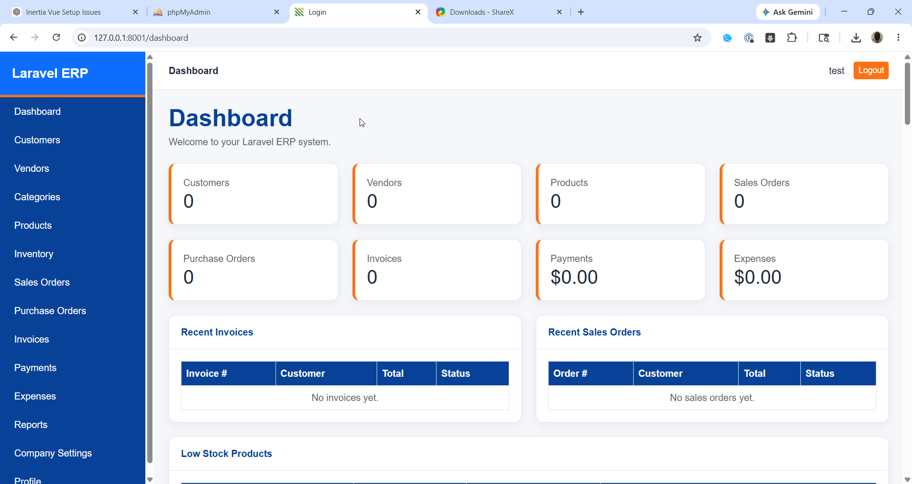
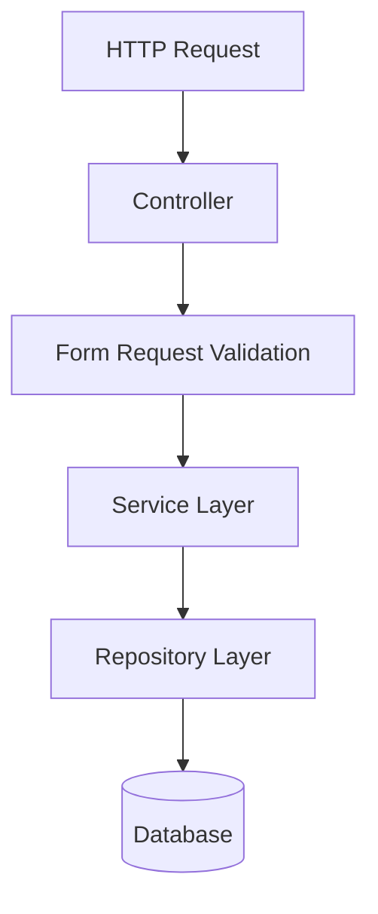
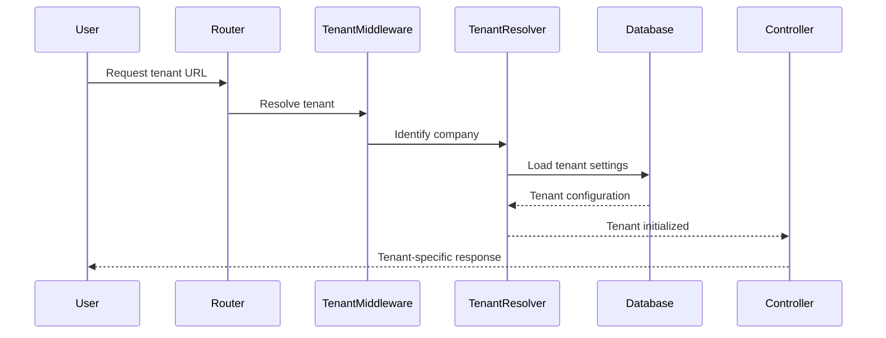
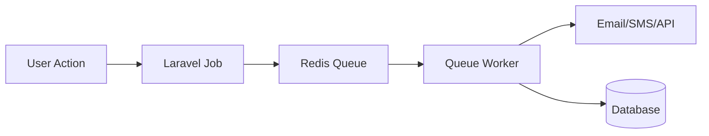
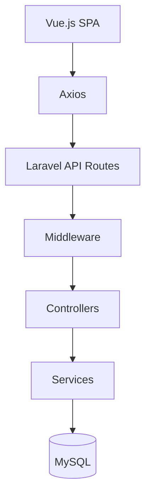
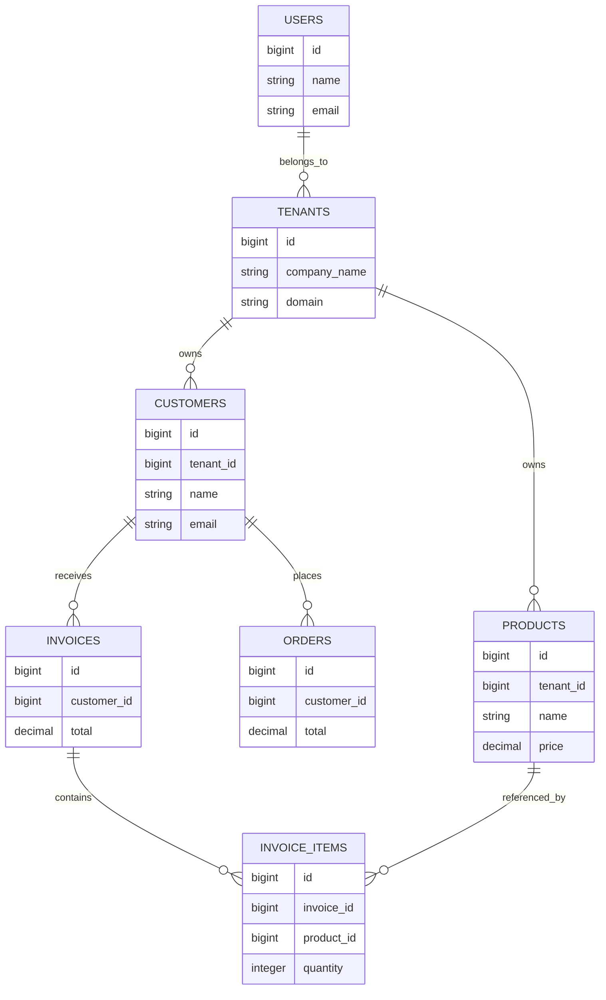

# Laravel ERP System

A modern full-stack Enterprise Resource Planning (ERP) platform built with Laravel, Vue.js, MySQL, and Bootstrap 5.  
This application helps businesses manage operations including customers, inventory, sales, invoices, vendors, purchasing, and reporting from a centralized web-based dashboard.

---

# Overview

This ERP system is designed for small-to-medium businesses that need a centralized solution for managing daily business operations.

The application provides modules for:

- Customer Management
- Product & Inventory Management
- Sales Orders
- Invoicing
- Vendor Management
- Purchase Orders
- Reporting & Analytics
- User Authentication
- Dashboard Metrics
- Business Administration

The system is built using a modular architecture that allows future expansion into accounting, HR, payroll, CRM, and logistics.

---

# Business Problem Solved

Many growing businesses struggle with:

- Disconnected spreadsheets
- Manual inventory tracking
- Poor visibility into sales
- Inconsistent invoicing
- Lack of centralized reporting
- Inefficient operational workflows
- Duplicate data entry
- Difficulty scaling operations

This ERP system solves those problems by consolidating business processes into a single integrated platform.

---

# Core Business Benefits

## 1. Centralized Business Operations

All operational data is managed from one application:

- Customers
- Products
- Orders
- Vendors
- Inventory
- Invoices

This reduces operational fragmentation and improves efficiency.

---

## 2. Inventory Visibility

Businesses can:

- Track stock levels
- Monitor inventory movement
- Reduce stock shortages
- Prevent overstocking
- Manage product catalogs efficiently

---

## 3. Streamlined Sales Management

The system simplifies:

- Sales order processing
- Customer tracking
- Invoice generation
- Payment management
- Revenue reporting

---

## 4. Improved Reporting & Analytics

Management gains visibility into:

- Sales performance
- Inventory trends
- Customer activity
- Revenue metrics
- Operational KPIs

---

## 5. Scalable Business Infrastructure

The ERP platform provides a scalable foundation that supports future growth without relying on disconnected tools or spreadsheets.

---

# Core Features

## Dashboard

- Business KPIs
- Revenue summaries
- Sales analytics
- Inventory alerts
- Recent activity feeds

---

## Customer Management

- Customer profiles
- Contact management
- Customer history
- Sales tracking
- Customer search/filtering

---

## Product Management

- Product catalog
- Categories
- SKU management
- Pricing management
- Product inventory tracking

---

## Inventory Management

- Stock tracking
- Inventory adjustments
- Inventory alerts
- Warehouse-ready structure
- Inventory movement history

---

## Sales Orders

- Order creation
- Order tracking
- Order status management
- Customer order history

---

## Invoice Management

- Invoice generation
- Payment tracking
- Invoice statuses
- Printable invoices

---

## Vendor Management

- Vendor records
- Purchase management
- Supplier tracking

---

## Reporting

- Sales reports
- Inventory reports
- Customer reports
- Revenue analytics

---

# Technology Stack

## Backend

- PHP 8.x
- Laravel 11/12
- RESTful Controllers
- Laravel Validation
- Laravel Eloquent ORM
- Laravel Middleware
- Laravel Authentication

---

## Frontend

- Vue.js 3
- Pinia State Management
- Axios
- Bootstrap 5
- Blade Templates
- JavaScript (ES6)

---

## Database

- MySQL / MariaDB

---

## Build Tools

- Vite
- NPM

---

## Authentication & Security

- Laravel Breeze
- CSRF Protection
- Session Authentication
- Form Validation
- Route Middleware Protection

---

## Infrastructure

- Apache
- Ubuntu Linux
- Docker (development environment)
- GitHub Version Control

---

# System Architecture

The application follows a layered MVC architecture:

```text
Frontend (Vue.js + Bootstrap)
        ↓
Laravel Controllers
        ↓
Business Logic / Services
        ↓
Eloquent Models
        ↓
MySQL Database
````

This architecture provides:

* Clean separation of concerns
* Maintainability
* Scalability
* Reusable business logic
* Organized code structure

---

# Example Use Cases

## Retail Businesses

Manage:

* Inventory
* Sales
* Customers
* Vendors
* Invoices

---

## Distribution Companies

Track:

* Products
* Warehouse inventory
* Purchase orders
* Customer orders

---

## Service Companies

Handle:

* Client management
* Billing
* Reporting
* Operational workflows

---

# Scalability

The ERP system is designed to support:

* Multi-department operations
* Large product catalogs
* High transaction volumes
* Additional business modules
* API integrations
* Cloud deployment

---

# Future Enhancements

Potential future modules include:

* Accounting
* Payroll
* Human Resources
* CRM
* POS Integration
* Shipping & Logistics
* Mobile Applications
* AI-powered reporting
* Multi-tenant SaaS support

---

# Developer Highlights

This project demonstrates expertise in:

* Enterprise application architecture
* Laravel full-stack development
* Vue.js integration
* Business workflow automation
* ERP system design
* Database architecture
* API development
* Responsive UI/UX design

---

# Author

Developed by Keith Jordan
Senior Full Stack Web Application Developer

Specializing in:

* Laravel
* PHP
* Vue.js
* ERP systems
* SaaS platforms
* Database architecture
* Enterprise web applications

---

## Screenshots

### Dashboard

  

  ---

 
---

# Laravel Service Layer

The application uses a dedicated Service Layer pattern to separate business logic from controllers.

## Service Layer Diagram



---

## Example Structure

```bash
app/
├── Services/
│   ├── CustomerService.php
│   ├── InvoiceService.php
│   ├── PayrollService.php
│   ├── InventoryService.php
│   └── ReportService.php
```

---

# Multi-Tenant Flow

EnterpriseERP supports multi-tenancy using a single database architecture with tenant isolation.

## Multi-Tenant Request Flow



---

## Tenant Features

* Company isolation
* Tenant-specific settings
* Tenant billing
* Tenant subscriptions
* Separate branding
* Per-tenant data filtering

---

# Queue System

EnterpriseERP uses Laravel queues for background processing.

## Queue Architecture



---

## Queue Jobs

Examples:

* Invoice generation
* Payroll processing
* Email notifications
* Report exports
* Data imports
* Scheduled backups

---

# API Architecture

EnterpriseERP uses an API-first architecture.

## API Flow



---

## API Features

* RESTful endpoints
* Sanctum authentication
* Token-based security
* Rate limiting
* JSON responses
* API resources
* Versioned APIs

---

# Database ERD

## Entity Relationship Diagram



---

# Folder Structure

```bash
app/
├── Http/
├── Models/
├── Services/
├── Repositories/
├── Jobs/
├── Events/
├── Notifications/
├── Policies/
├── Console/
└── Providers/

resources/
├── js/
│   ├── components/
│   ├── pages/
│   ├── stores/
│   └── layouts/
│
├── views/
└── css/
```

---

# Installation

## Clone Repository

```bash
git clone https://github.com/yourusername/enterprise-erp.git
```

---

## Install Dependencies

```bash
composer install
npm install
```

---

## Configure Environment

```bash
cp .env.example .env
```

Update:

```env
APP_NAME=EnterpriseERP

DB_CONNECTION=mysql
DB_HOST=127.0.0.1
DB_PORT=3306
DB_DATABASE=enterprise_erp
DB_USERNAME=root
DB_PASSWORD=
```

---

## Generate App Key

```bash
php artisan key:generate
```

---

## Run Migrations

```bash
php artisan migrate --seed
```

---

## Start Development Server

```bash
php artisan serve
npm run dev
```

---

# Queue Setup

## Run Queue Worker

```bash
php artisan queue:work
```

---

## Redis Queue

```env
QUEUE_CONNECTION=redis
```

---

# API Authentication

Using Laravel Sanctum:

```bash
php artisan install:api
```

---

# Security Features

* CSRF protection
* XSS filtering
* Tenant isolation
* Password hashing
* API token security
* Role-based permissions
* Request validation
* Audit logging

---

# Deployment

## Production Build

```bash
npm run build
```

---

## Optimize Laravel

```bash
php artisan optimize
```

---

## Queue Worker

```bash
php artisan queue:work --daemon
```

---

# Testing

## Run Tests

```bash
php artisan test
```

---

# Future Enhancements

* AI reporting
* Predictive analytics
* Mobile app
* POS integration
* Multi-currency support
* WebSocket real-time dashboards
* Stripe subscriptions
* SaaS billing engine

---

# Contributing

Pull requests are welcome.

Please open an issue first to discuss proposed changes.

---

# License

MIT License

---

# Author

## Keith Jordan

Senior Full Stack Web Applications Engineer

* Laravel
* Vue.js
* PHP
* MySQL
* Multi-Tenant SaaS Architecture
* ERP Systems
* Enterprise API Development

---

```
```

