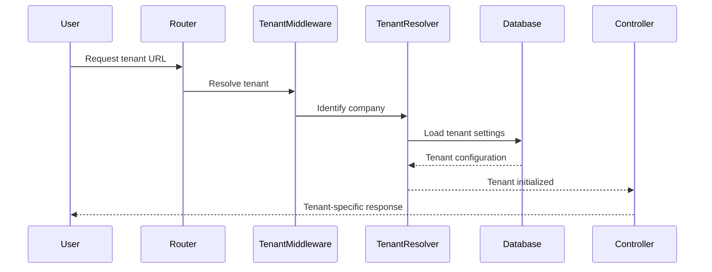
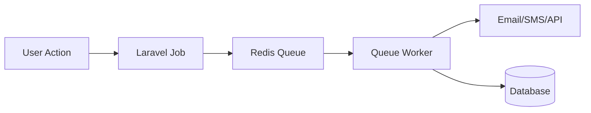
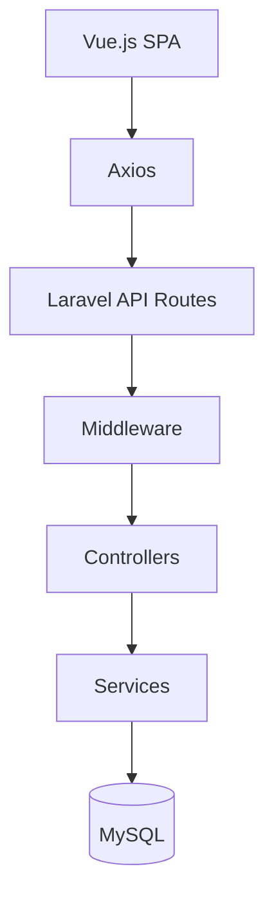
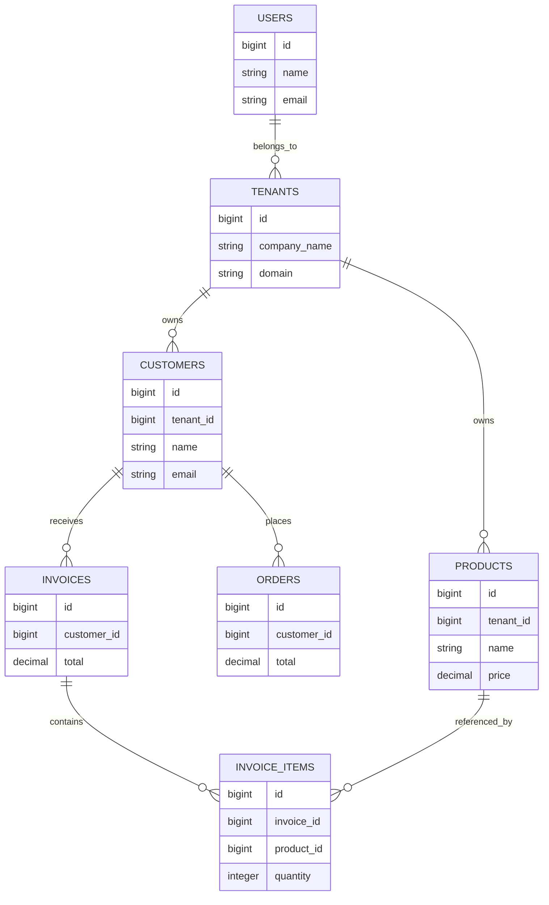

# EnterpriseERP

---

# Overview

EnterpriseERP is a scalable, modular, multi-tenant ERP platform designed for businesses that need an all-in-one solution for:

- Customer Management
- Sales & Invoicing
- Inventory Tracking
- Accounting
- Purchasing
- HR & Payroll
- Reporting & Analytics
- Vendor Management
- Role-Based Access
- API Integrations
- Queue & Background Processing

The platform is optimized for:

- SaaS deployment
- Enterprise organizations
- Multi-company support
- REST API integrations
- High scalability
- Cloud-ready architecture

---

# Business Problem Solved

Most organizations struggle with disconnected systems:

- One system for accounting
- Another for HR
- Another for inventory
- Separate CRMs
- Manual spreadsheets
- Duplicate data entry

EnterpriseERP centralizes business operations into a single platform.

## Benefits

✅ Centralized business management  
✅ Reduced operational costs  
✅ Real-time reporting  
✅ Automated workflows  
✅ Improved team collaboration  
✅ Better inventory visibility  
✅ Scalable SaaS architecture  
✅ Multi-tenant company isolation  
✅ API-first integrations  

---

# Tech Stack

## Backend

- Laravel 13
- PHP 8.4+
- MySQL 8
- RESTful API
- Laravel Queues
- Laravel Events
- Laravel Notifications
- Laravel Policies
- Service Layer Architecture

## Frontend

- Vue.js 3
- Pinia
- Axios
- Bootstrap 5
- Vite
- JavaScript ES6+

## Infrastructure

- Apache / Nginx
- Redis
- Supervisor
- Docker Ready
- AWS Compatible

---

# Features

## Core Modules

### CRM

- Customer management
- Leads
- Contacts
- Activity logs

### Sales

- Quotations
- Orders
- Invoices
- Payments

### Inventory

- Product catalog
- Warehouses
- Stock transfers
- Barcode support

### Purchasing

- Vendors
- Purchase orders
- Procurement workflows

### HR & Payroll

- Employees
- Departments
- Attendance
- Payroll processing

### Accounting

- Journals
- General ledger
- Expense tracking
- Financial reports

### Reporting

- Sales analytics
- Inventory analytics
- Profit & loss
- KPI dashboards

---

# Screenshots

## Dashboard


---

## CRM Module


---

## Inventory Module


---

## Invoice Management


---

# System Architecture

## High-Level Application Architecture

```mermaid
flowchart LR

A[Vue.js Frontend]
B[Laravel API Layer]
C[Service Layer]
D[Repositories]
E[(MySQL Database)]
F[Redis Queue]
G[Workers]

A --> B
B --> C
C --> D
D --> E

C --> F
F --> G
````

---

# Laravel Service Layer

The application uses a dedicated Service Layer pattern to separate business logic from controllers.

## Service Layer Diagram

```mermaid
flowchart TD

A[HTTP Request]
B[Controller]
C[Form Request Validation]
D[Service Layer]
E[Repository Layer]
F[(Database)]

A --> B
B --> C
C --> D
D --> E
E --> F
```

---

## Example Structure

```bash
app/
├── Services/
│   ├── CustomerService.php
│   ├── InvoiceService.php
│   ├── PayrollService.php
│   ├── InventoryService.php
│   └── ReportService.php
```

---

# Multi-Tenant Flow

EnterpriseERP supports multi-tenancy using a single database architecture with tenant isolation.

## Multi-Tenant Request Flow



---

## Tenant Features

* Company isolation
* Tenant-specific settings
* Tenant billing
* Tenant subscriptions
* Separate branding
* Per-tenant data filtering

---

# Queue System

EnterpriseERP uses Laravel queues for background processing.

## Queue Architecture



---

## Queue Jobs

Examples:

* Invoice generation
* Payroll processing
* Email notifications
* Report exports
* Data imports
* Scheduled backups

---

# API Architecture

EnterpriseERP uses an API-first architecture.

## API Flow



---

## API Features

* RESTful endpoints
* Sanctum authentication
* Token-based security
* Rate limiting
* JSON responses
* API resources
* Versioned APIs

---

# Database ERD

## Entity Relationship Diagram



---

# Folder Structure

```bash
app/
├── Http/
├── Models/
├── Services/
├── Repositories/
├── Jobs/
├── Events/
├── Notifications/
├── Policies/
├── Console/
└── Providers/

resources/
├── js/
│   ├── components/
│   ├── pages/
│   ├── stores/
│   └── layouts/
│
├── views/
└── css/
```

---

# Installation

## Clone Repository

```bash
git clone https://github.com/yourusername/enterprise-erp.git
```

---

## Install Dependencies

```bash
composer install
npm install
```

---

## Configure Environment

```bash
cp .env.example .env
```

Update:

```env
APP_NAME=EnterpriseERP

DB_CONNECTION=mysql
DB_HOST=127.0.0.1
DB_PORT=3306
DB_DATABASE=enterprise_erp
DB_USERNAME=root
DB_PASSWORD=
```

---

## Generate App Key

```bash
php artisan key:generate
```

---

## Run Migrations

```bash
php artisan migrate --seed
```

---

## Start Development Server

```bash
php artisan serve
npm run dev
```

---

# Queue Setup

## Run Queue Worker

```bash
php artisan queue:work
```

---

## Redis Queue

```env
QUEUE_CONNECTION=redis
```

---

# API Authentication

Using Laravel Sanctum:

```bash
php artisan install:api
```

---

# Security Features

* CSRF protection
* XSS filtering
* Tenant isolation
* Password hashing
* API token security
* Role-based permissions
* Request validation
* Audit logging

---

# Deployment

## Production Build

```bash
npm run build
```

---

## Optimize Laravel

```bash
php artisan optimize
```

---

## Queue Worker

```bash
php artisan queue:work --daemon
```

---

# Testing

## Run Tests

```bash
php artisan test
```

---

# Future Enhancements

* AI reporting
* Predictive analytics
* Mobile app
* POS integration
* Multi-currency support
* WebSocket real-time dashboards
* Stripe subscriptions
* SaaS billing engine

---

# Contributing

Pull requests are welcome.

Please open an issue first to discuss proposed changes.

---

# License

MIT License

---

# Author

## Keith Jordan

Senior Full Stack Web Applications Engineer

* Laravel
* Vue.js
* PHP
* MySQL
* Multi-Tenant SaaS Architecture
* ERP Systems
* Enterprise API Development

---

```
```
